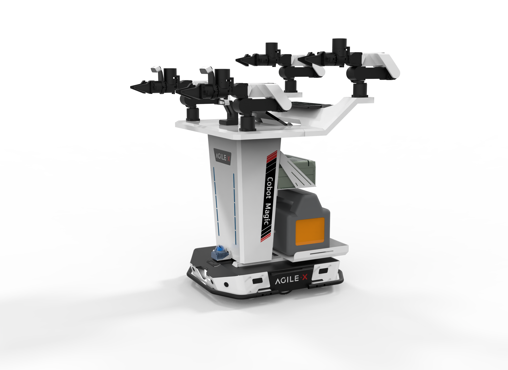
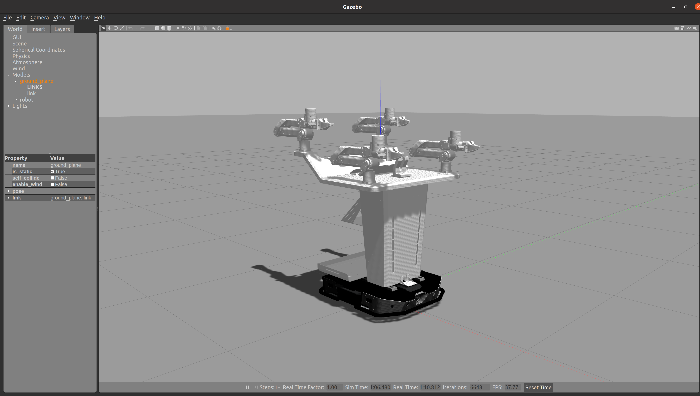
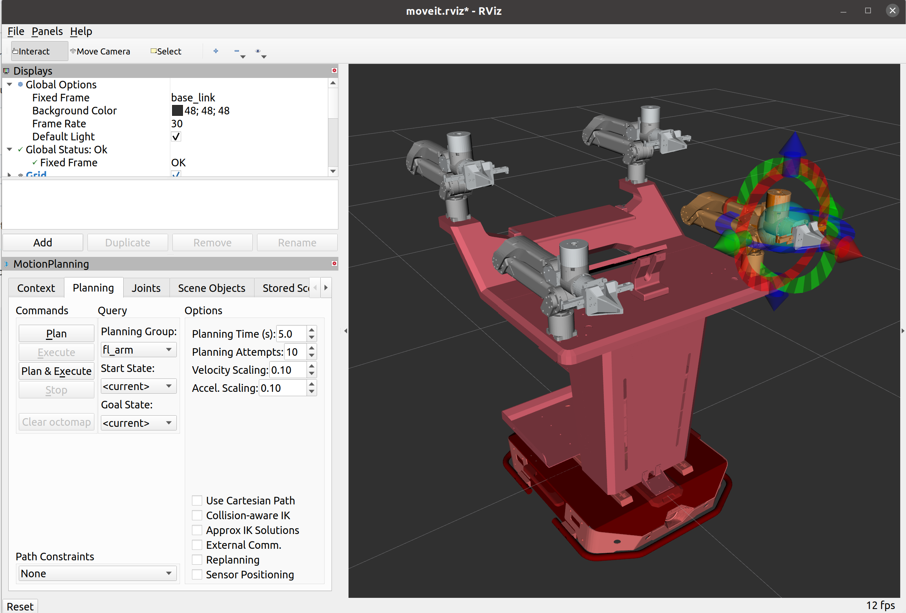
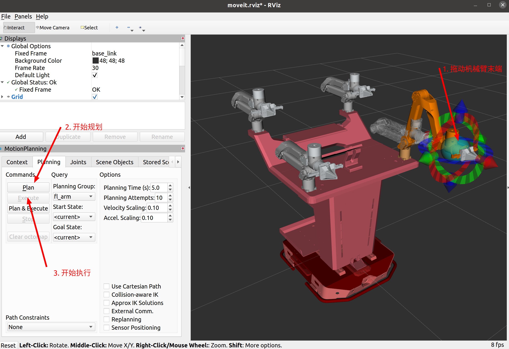
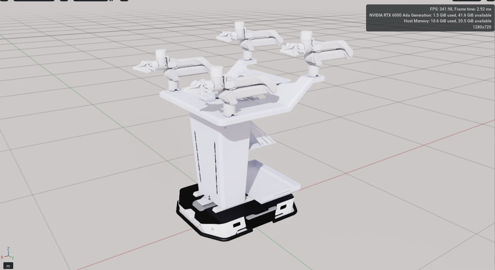

# mobile_aloha_sim




## 测试环境

ubuntu 20.04

ros noetic

gazebo version 11

## 编译

``` bash
mkdir aloha_sim_ws
cd aloha_sim_ws
mkdir src
cd src
git clone https://github.com/agilexrobotics/mobile_aloha_sim
cd ..
catkin_make
```

## 文件目录

```
├── aloha_description
│   ├── aloha
│   ├── arx5_description
│   ├── arx5-urdf
│   │   ├── arx5
│   │   └── arx5p2
│   ├── livox_laser_simulation
│   └── tracer
│       ├── image
│       ├── tracer_description
│       └── tracer_gazebo_sim
├── aloha_mujoco
|   └── aloha
|       ├── CMakeLists.txt
|       ├── meshes_mujoco
|       │   ├── aloha_v1.xml
|       │   └── meshes_mujoco
|       ├── package.xml
|       └── scripts
|           ├── aloha_ctrl.py
|           └── aloha_ctrl_test.py
├── arx5_moveit_config
│   ├── config
│   └── launch
└── doc
```

其中，aloha_mujoco是mujoco仿真下的实现，具体请参考aloha_mujoco文件夹中的[README](./aloha_mujoco/README.MD)

## 启动仿真

### gazebo仿真

``` bash
roslaunch arx5_moveit_config demo_gazebo.launch
```







启动gazebo仿真后有两个窗口，一个是gazebo物理仿真窗口，一个是rviz窗口，在rviz窗口中可以调用moveit组件规划机械臂

在gazebo仿真窗口中，右侧画面显示的是实时的物理仿真环境，机械臂的位置信息以及运动学模拟信息都在这里显示，gazebo也将反馈仿真的机械臂状态，执行规划器发送的控制角度

在rviz仿真窗口中，左下侧显示的是moveit组件的ui界面，这里可以选择不同的规划组(Planning Group)来控制不同的机械臂和夹爪。右侧窗口显示的是实时的机械臂位置，这个是由gazebo仿真提供的

#### 移动底盘

``` bash
rosrun teleop_twist_keyboard teleop_twist_keyboard.py
```

打开键盘控制节点，可以下发速度控制底盘移动

#### 移动机械臂

在rviz界面中拖动示教球，按如图所示操作，机械臂将根据目标末端夹爪位置，计算出关节角度和机械臂轨迹



需要注意的是，当点击Plan开始规划后，系统需要时间计算，待Execute按键由灰转变为黑色，点击即可执行刚才计划的轨迹。

### rviz仿真

rviz仿真和gazebo仿真的唯一区别就是不启动物理仿真引擎gazebo，而是只启动数据可视化平台rviz

``` bash
roslaunch arx5_moveit_config demo.launch
```

启动后和gazebo仿真里的rviz界面一样，按照上文操作即可。


## isaac sim仿真

### isaac sim 下载

https://developer.nvidia.com/isaac-sim  点击下载omniverse，然后在omniverse_launcher的“交易所/exchange”中搜索isaac sim，下载isaac sim

本仓库提供了用于isaac sim仿真导入的urdf : aloha_isaac_sim/urdf/arx5_description_isaac.urdf

在omniverse_launcher中启动isaac sim，然后上方工具栏isaac utils->workflows->URDF Importer->在弹出的窗口中找到下方的Import->Input File选择urdf路径->点击Import

导入isaac sim后效果如下：


