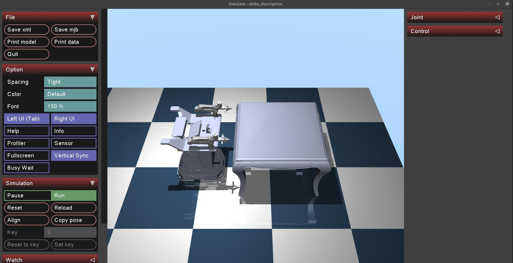
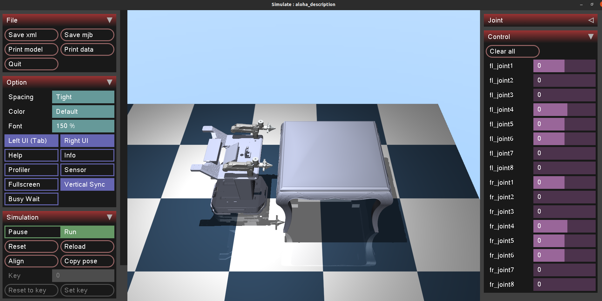
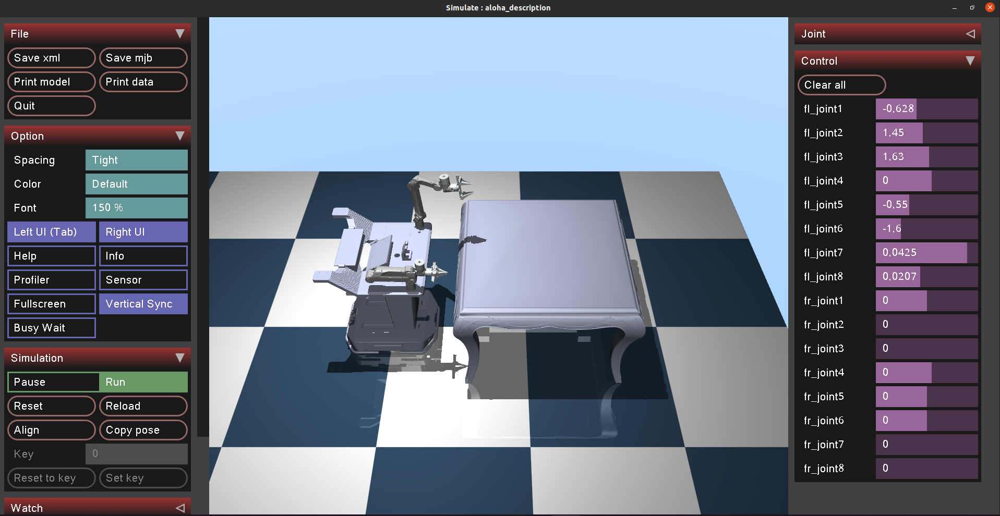
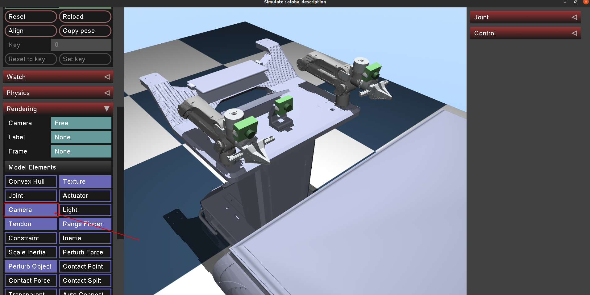
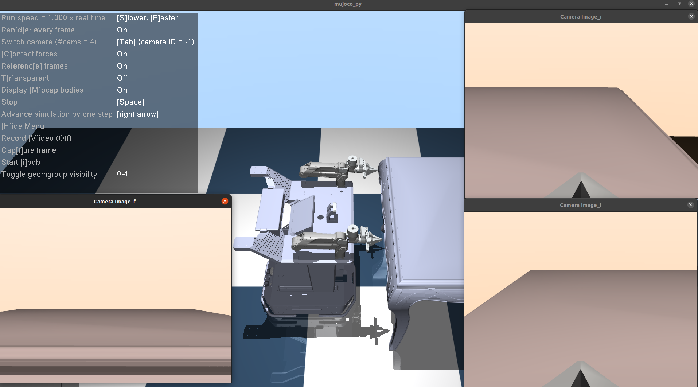

# aloha mujoco 仿真环境搭建

ps:本文运行环境在Ubuntu20.04

## 搭建mujoco环境

### Install MuJoCo 安装 MuJoCo

1. Download the MuJoCo version 2.1 binaries for [Linux](https://mujoco.org/download/mujoco210-linux-x86_64.tar.gz) or [OSX](https://mujoco.org/download/mujoco210-macos-x86_64.tar.gz).  

    下载适用于 Linux 或 OSX 的 MuJoCo 版本 2.1 二进制文件。

2. 将下载 `mujoco210` 的目录解压缩到 `~/.mujoco/mujoco210` .

### Install and use `mujoco-py`  

详见:<https://github.com/openai/mujoco-py>

要在 Ubuntu 上安装 mujoco-py，请确保已安装以下库：

```bash
sudo apt install libosmesa6-dev libgl1-mesa-glx libglfw3
```

如果您安装了上述库，但仍然看到 `-lGL` 找不到的错误，则很可能需要直接创建符号链接：

```bash
sudo ln -s /usr/lib/x86_64-linux-gnu/libGL.so.1 /usr/lib/x86_64-linux-gnu/libGL.so
```

要包含在 `mujoco-py` 您自己的包中，请将其添加到您的要求中，如下所示：

```bash
pip install -U 'mujoco-py<2.2,>=2.1'
```

## Troubleshooting 故障 排除

### Missing GLFW 缺少 GLFW

安装时的常见错误是：

```bash
raise ImportError("Failed to load GLFW3 shared library.")
```

当 `glfw` python 包找不到 GLFW 动态库时，会发生这种情况。

MuJoCo 附带了此库的副本，可以在安装过程中使用。

将 mujoco bin 目录的路径添加到动态加载程序中：

```bash
LD_LIBRARY_PATH=$LD_LIBRARY_PATH:$HOME/.mujoco/mujoco210/bin
```

# 打开aloha仿真环境

目录结构如下:

```bash

aloha_mujoco
    └── aloha
        ├── CMakeLists.txt
        ├── meshes_mujoco
        │   ├── aloha_v1.xml
        │   └── meshes_mujoco
        ├── package.xml
        └── scripts
            ├── aloha_ctrl.py
            └── aloha_ctrl_test.py

```

其中,`meshes_mujoco` 主要存储stl文件和`mujoco`的描述`xml`文件

使用`mujoco`打开`aloha_v1.xml`文件:

```bash
~/.mujoco/mujoco210/bin/simulate /<your path>/aloha_mujoco/aloha/meshes_mujoco/aloha_v1.xml
```

不出意外就会显示如下界面


## 界面介绍

### 右侧栏

`joint` 用来显示每个关节的角度,单位是弧度


`control` 用来控制关节角度,单位是弧度



单独拖动 `control` 内的滑动条可以控制机械臂某个关节运动



左侧栏下滑看到`Randering`选项卡,点开后下滑,将`Model Elements`选项卡内的`Camera`选项点亮后,可以看到三个相机的视角位置:



### 使用 `python` 文件打开 `aloha` 仿真环境

#### 执行test

ps:前提要安装`mujoco_py`并在`bashrc`中增加如下:

```bash
export LD_LIBRARY_PATH=$LD_LIBRARY_PATH:/usr/lib/nvidia
export LD_LIBRARY_PATH=$LD_LIBRARY_PATH:$HOME/.mujoco/mujoco210/bin
export LD_PRELOAD=$LD_PRELOAD:/usr/lib/x86_64-linux-gnu/libGLEW.so:/usr/lib/x86_64-linux-gnu/libGL.so
```

运行文件夹中的`aloha_mujoco/aloha/scripts/aloha_ctrl_test.py`文件,会弹出七个窗口,但是其中三个是没有画面的,因为相机画面通过opencv另建窗口发出来了

如下:


机械臂会每隔2s运动一下,可以看到相机画面也跟着变化

#### 执行两个机械臂跟随真实世界主机械臂运动

首先需要新开终端启动 `roscore`

其次要运行主机械臂节点,两个机械臂节点都要打开,检查`/master/joint_left` 和 `/master/joint_right` 数据是否正常

接着运行 `aloha_ctrl.py` 文件,若运行没有问题,同上面一样,会弹出七个窗口,就可以运动主机械臂来控制仿真环境里面的机械臂了


